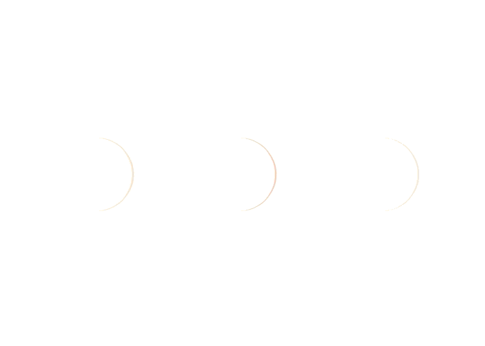
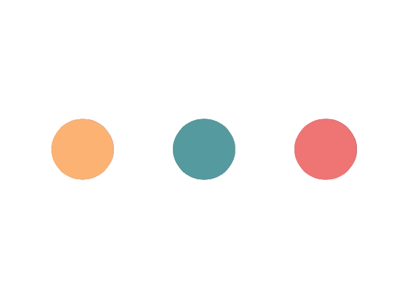
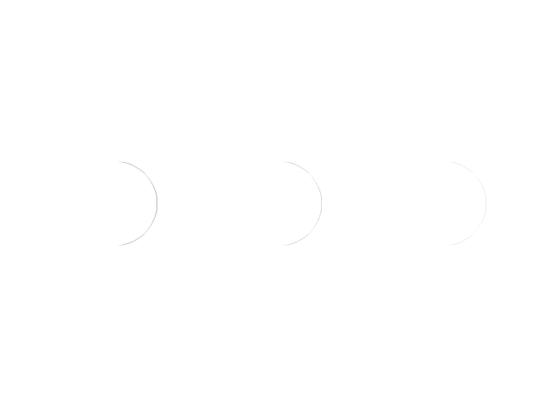
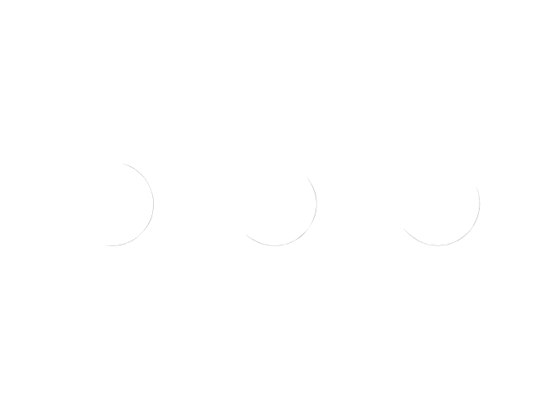
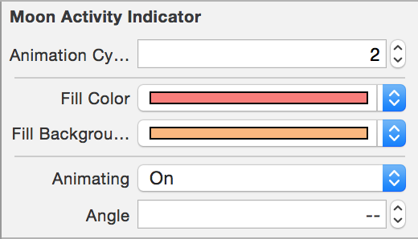

# MoonPhasesActivityIndicator

An alternative to UIActivityIndicator.


Adjustable color
```
var fillColor:UIColor
```


Adjustable background color
```
var fillBackgroundColor:UIColor
```


Adjustable animation cycle duration
```
var animationCycleDuration:Double 
```


Adjustable angle
```
var angle:CGFloat
```


These properties are all @IBInspectable

